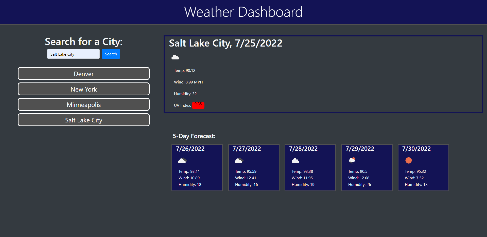

# Weather Dashboard

<!-- ABOUT THE PROJECT -->
## About The Project

For the sixth challenge, `Weather Dashboard`, I created this dashboard with `Bootstrap` for the layout. It took awhile to get the webpage to look how I wanted it to look using `Bootstrap` but eventually using it became easier and I know have a better understanding of how Bootstrap works with the `containers`, `rows`, and different variations of `col-12`. Using the `OpenWeatherMap API` at first was challening but after getting the hang of it, it became fairly simple to understand and use and it was very useful in understanding how to navigate API's more. Getting the icons from `OpenWeatherMap` took some time to figure out but eventually I got it working. I used previous Zoom recordings, previous challenges and activites, MDN, and I used this link (`https://www.youtube.com/watch?v=nGVoHEZojiQ&ab_channel=SteveGriffith-Prof3ssorSt3v3`) to understand how to use the 
OpenWeatherMap API more. 

When a user enters a city name into the search box then the current weather box is filled with the `city name`, `date`, an `icon` representing the weather, `temperature`, `wind speed`, `humidity`, and the `uv index` plus a colored box depending how how high the uv index is currently. The 5-day forecast is also filled in after a city has been searched showing the `date`, an `icon` representing the weather `temperature`, `wind speed`, and `humidity` for the next 5 days. The city that was just searched is added to the `previous searched list` and it is added to `localstorage`. If the user clicks that `list item`, then the same information is displayed about that city.

<!-- BUILT WITH -->
## Built With
<ul>
    <li> HTML
    <li> CSS
    <li> JavaScript
    <li> JQuery
    <li> OpenWeatherMap API
    <li> Bootstrap
</ul>

<!-- CONTACT ME -->
## Contact

Zachry Jorgensen - z.d.jorgensen@gmail.com

Project Link: [https://zdjorgensen.github.io/Weather-Dashboard/]

(<a href="#top">Back to Top</a>)
